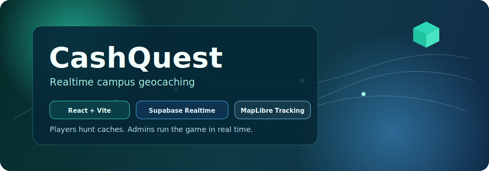

# CashQuest



Realtime campus geocaching game with a live map, team leaderboard, and full admin control.

[](https://react.dev/)
[](https://www.typescriptlang.org/)
[](https://vitejs.dev/)
[](https://supabase.com/)
[](https://maplibre.org/)

## Why CashQuest

CashQuest is designed for live events like campus hunts or club challenges where game operators need to monitor progress in real time.

- Team join flow with persistent local session
- Live player map tracking through Supabase Presence
- Cache claim mechanic with secret codes and instant score updates
- Real-time leaderboard with rank updates
- Admin dashboard for creating, editing, and deleting caches
- Mission reset flow for quick event reruns

## Tech Stack

- Frontend: React 19, TypeScript, Vite, Tailwind CSS
- Maps: MapLibre GL + OSM/ArcGIS raster tiles
- Backend: Supabase (Postgres, Auth, Realtime)
- Realtime patterns:
- `postgres_changes` for caches and leaderboard updates
- Presence for live player tracking

## Project Structure

```text
src/
  components/
    admin/
  hooks/
  lib/
  screens/
supabase/
  migrations/
  seed.sql
create-admin.mjs
broadcast-mock-player.mjs
```

## Quick Start

### 1. Install dependencies

```bash
npm install
```

### 2. Start local Supabase

```bash
supabase start
supabase db reset
```

### 3. Create the admin user

```bash
node create-admin.mjs
```

### 4. Configure environment variables

Create `.env.local`:

```bash
VITE_SUPABASE_URL=http://127.0.0.1:54321
VITE_SUPABASE_ANON_KEY=your_local_anon_key
```

Tip: run `supabase status` to get local API URL and anon key.

### 5. Start the app

```bash
npm run dev
```

Open `http://localhost:5173`.

## Admin Access

- Admin login route: `/admin/login`
- Local seeded convenience login:
- Email: `admin`
- Password: `admin`
- After your first login, change the admin password from the dashboard Settings view.

The UI maps this shortcut to:

- Email: `admin@cashquest.com`
- Password: `adminpassword123`

## Database Notes

Core entities:

- `users` - team identity + score
- `caches` - hunt points, status, finder reference

Behavior:

- Score increments via database trigger when caches are claimed
- Realtime enabled for cache and user updates

## Extras

- `broadcast-mock-player.mjs` can simulate a moving player for testing admin live tracking.
